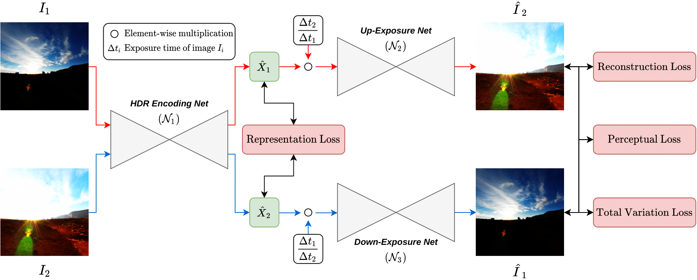

## Table of contents

1. [Get Started](#Get-Started)
2. [Training and evaluation](#Training-and-evaluation)
3. [Contacts](#Contacts)
# [WACV 2023] Single-Image HDR Reconstruction by Multi-Exposure Generation

[Phuoc-Hieu Le](https://hieultp.github.io/), [Quynh Le](https://www.linkedin.com/in/quynhtle/), [Rang Nguyen](https://rangnguyen.github.io/), [Binh-Son Hua](https://sonhua.github.io/)

<p align="center">
  
</p>

**Abstract:** <em>High dynamic range</em> (HDR) imaging is an indispensable technique in modern photography. Traditional methods focus on HDR reconstruction from multiple images, solving the core problems of image alignment, fusion, and tone mapping, yet having a perfect solution due to ghosting and other visual artifacts in the reconstruction. Recent attempts at single-image HDR reconstruction show a promising alternative: by learning to map pixel values to their irradiance using a neural network, one can bypass the align-and-merge pipeline completely yet still obtain a high-quality HDR image. In this work, we propose a weakly supervised learning method that inverts the physical image formation process for HDR reconstruction via learning to generate multiple exposures from a single image. Our neural network can invert the camera response to reconstruct pixel irradiance before synthesizing multiple exposures and hallucinating details in under- and over-exposed regions from a single input image. To train the network, we propose a representation loss, a reconstruction loss, and a perceptual loss applied on pairs of under- and over-exposure images and thus do not require HDR images for training. Our experiments show that our proposed model can effectively reconstruct HDR images. Our qualitative and quantitative results show that our method achieves state-of-the-art performance on the DrTMO dataset.

Details of the model architecture as well as experimental results can be found in [our following paper](https://arxiv.org/abs/2210.15897): 

```bibtex
@inproceedings{le2023singlehdr,
    title={Single-Image HDR Reconstruction by Multi-Exposure Generation},
    author={Phuoc-Hieu Le and Quynh Le and Rang Nguyen and Binh-Son Hua},
    booktitle={Proceedings of the IEEE/CVF Winter Conference on Applications of Computer Vision (WACV)},
    month={January},
    year={2023},
}
```

Please **CITE** our paper whenever this repository is used to help produce published results or incorporated into other software.

[**Project Page**](https://hieultp.github.io/publication/single-image-hdr) 

## Get Started

1. Clone this repository

```bash
git clone https://github.com/VinAIResearch/single_image_hdr
cd single_image_hdr
```

2. Setup the environment

```bash
conda env create -n single-image-hdr -f environment.yml
conda activate single-image-hdr
```

## Training and evaluation

### Training 

Please refer to the following link below to download and unzip the dataset: [DrTMO](https://uithcm-my.sharepoint.com/:u:/g/personal/17520474_ms_uit_edu_vn/ET6uk6buZdlDnDkcJlRS_PEB6AoENYqFEqnPB5fn8r-oVQ?e=ddLdbw)

To reproduce the model in the paper, start the training process as:

```bash
  python train.py \
        --max_steps 200000 --precision 16 --benchmark \
        --gpus 4 --accelerator ddp --sync_batchnorm \
        --fp16_hook --multigpu \
        --train_dir training_data/Train/Bracketed_images/ \
        --train_label_path data/train.csv --val_label_path data/val.csv
```

Or to see all available training options:

```bash
python train.py --help
```

### Testing

The pretrained model can be found in [this link](https://uithcm-my.sharepoint.com/:u:/g/personal/17520474_ms_uit_edu_vn/EZa3EUzeLdNIibgD4vkixl4BgGTywlgSc9YnU7LRR4w_Jg?e=vgaYZr). To generate the bracketed images, run the following command:

```bash
python infer_bracketed.py --out_dir results/ --ckpt pretrained.ckpt --in_name e.png --num_workers 2 --test_dir training_data/Test/Bracketed_images/ --test_label_path data/test_hdr.csv
```

The resulted multi-exposure images then can be merged using Photomatix to generate an HDR image. We use the free version of Photomatix, specifically we used the `PhotomatixLinux2.0.1_Ubuntu20.04.deb` .
Other merge methods available in OpenCV could also be used to generate HDR images. But we found that these methods are prone to produce artifacts.

Evaluation metrics such as PSNR, SSIM, and LPIPS are from the [ `piq` ](https://github.com/photosynthesis-team/piq) package.

We also provided tone mapping source code to reproduce results in the paper in [src/utils](./src/utils)

## Contacts

If you have any questions or suggestions about this repo, please feel free to open an issue or contact me at hieultp1@gmail.com
